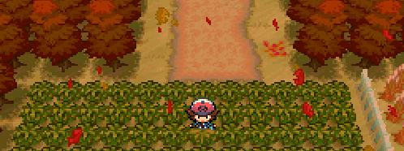

<!-- # Hey, I'm Arthur:-->

  

## About me:
Hi, my name is Arthur Teng, I currently specialize in doing full-stack development, while also doing hardware and computer vision projects on the side.
I enjoy building things that improve the quality of life and make people’s lives a little bit easier in this crazy world we live in. 

## Tech Stack:

 

## GitHub Stats:
 

---

